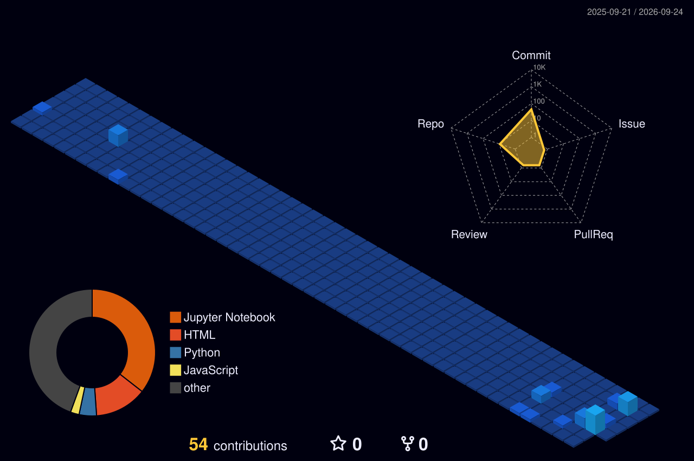

<picture>
  <source media="(prefers-color-scheme: dark)" srcset="https://coolreadme.xyz/api/typing-card?user=Ekagr-Bhatia&lines=I%20make%20things%20that%20shouldn't%20be%20this%20interesting.Making%20machines%20see%2C%20systems%20think%2C%20and%20ideas%20move.https%3A%2F%2Fgithub.com%2FEkagr-Bhatia&theme=dark">
  
</picture>

  

  
  &nbsp;
  
  &nbsp;
  

### 👨‍💻 About Me

<table width="100%">
<tr>
<td width="50%" valign="middle" align="left">

I'm a **Computer Science student** exploring AI/ML and software engineering, but mostly I'm just curious about how things work — and what happens when I try to build them myself.
  
I enjoy taking ideas down unexpected rabbit holes and turning them into projects, whether that's an AI system, a full-stack application, or something I absolutely did not need to spend a weekend building.

</td>
<td width="50%" valign="middle">

<table width="100%">
<tr>
<td align="center" width="33%">🧠 <b>Machine Learning</b> Models that learn</td>
<td align="center" width="33%">👁️ <b>Computer Vision</b> Image understanding</td>
<td align="center" width="33%">🤖 <b>Generative AI</b> LLMs · RAG · Agents</td>
</tr>
<tr>
<td align="center" width="33%">☁️ <b>Cloud & MLOps</b> Deploy · Monitor · Scale</td>
<td align="center" width="33%">🧩 <b>Full Stack Dev</b> End-to-end solutions</td>
<td align="center" width="33%">📊 <b>Data & Analytics</b> Turning data into insight</td>
</tr>
</table>

</td>
</tr>
</table>

### 🚀 Featured Projects

<picture>
  <source media="(prefers-color-scheme: dark)" srcset="https://coolreadme.xyz/api/projects-gallery?user=Ekagr-Bhatia&repos=Orbital_Guard_DL%2CNetwork_Intrusion_Detection%2CLand_Use_Land_Cover%2COrbitalGuard3D%2CCivic_Issues&copy=%7B%22Orbital_Guard_DL%22%3A%22Deep%20learning%20pipeline%20that%20predicts%20critical%20satellite%20collision%20risks%20from%20sequential%20orbital%20telemetry%2C%20benchmarking%20LSTM%2C%20CNN%2C%20autoenco%E2%80%A6%22%2C%22Network_Intrusion_Detection%22%3A%22GPU-accelerated%20network%20intrusion%20detection%20pipeline%20using%20meta-heuristic%20feature%20selection%2C%20imbalance-aware%20resampling%20and%20XGBoost%20to%20dete%E2%80%A6%22%2C%22Land_Use_Land_Cover%22%3A%22Multispectral%20satellite%20imagery%20platform%20that%20classifies%2013-band%20Sentinel-2%20scenes%20into%2010%20land-cover%20categories%20using%20deep%20learning%2C%20with%E2%80%A6%22%2C%22OrbitalGuard3D%22%3A%22Interactive%203D%20orbital%20simulation%20for%20visualizing%20satellite%20conjunctions%2C%20predicting%20collisions%20and%20experimenting%20with%20AI-assisted%20evasive%E2%80%A6%22%2C%22Civic_Issues%22%3A%22Full-stack%20MERN%20platform%20for%20reporting%20and%20resolving%20civic%20issues%2C%20combining%20role-based%20dashboards%2C%20geospatial%20complaint%20heatmaps%2C%20authenti%E2%80%A6%22%7D&layout=spotlight&theme=dark">
  
</picture>

### 🛠️ Tech Stack

  

<table width="100%">
<tr>
<td valign="top" width="17%" align="center">

**AI / ML**

 

</td>
<td valign="top" width="17%" align="center">

**Generative AI**

 

</td>
<td valign="top" width="16%" align="center">

**Backend & APIs**

 

</td>
<td valign="top" width="17%" align="center">

**Frontend**

 

</td>
<td valign="top" width="16%" align="center">

**Databases**

 

</td>
<td valign="top" width="17%" align="center">

**Cloud & DevOps**

 

</td>
</tr>
</table>

### 📊 GitHub Activity & Stats

  

  <picture>
    <source media="(prefers-color-scheme: dark)" srcset="https://coolreadme.xyz/api/stats-card?user=Ekagr-Bhatia&theme=dark">
    
  </picture>
  

  
  

### 🌐 3D Contribution Graph

### 🐍 Contribution Graph

<picture>
  <source media="(prefers-color-scheme: dark)" srcset="https://raw.githubusercontent.com/Ekagr-Bhatia/Ekagr-Bhatia/output/github-contribution-grid-snake-dark.svg">
  
</picture>

### 💭 Daily Quote

